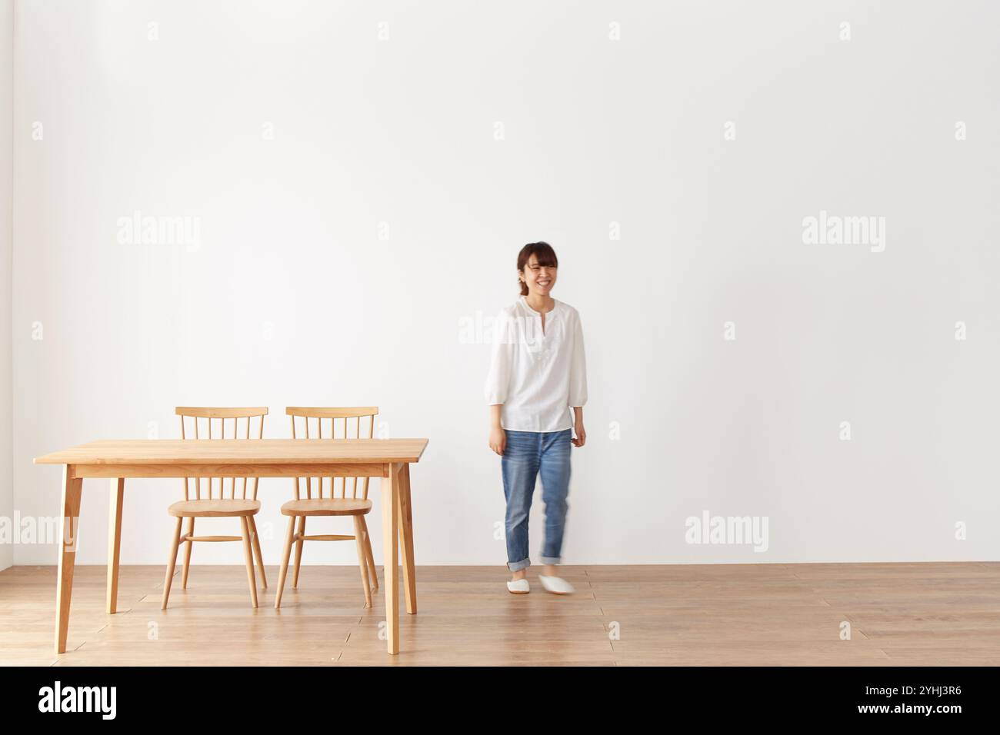
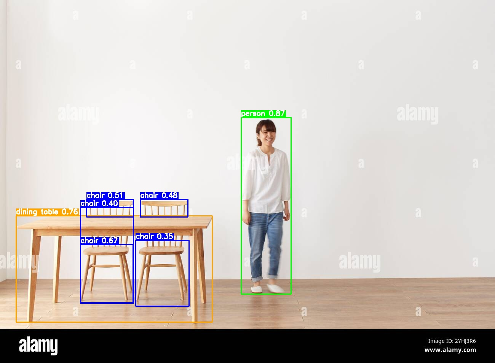
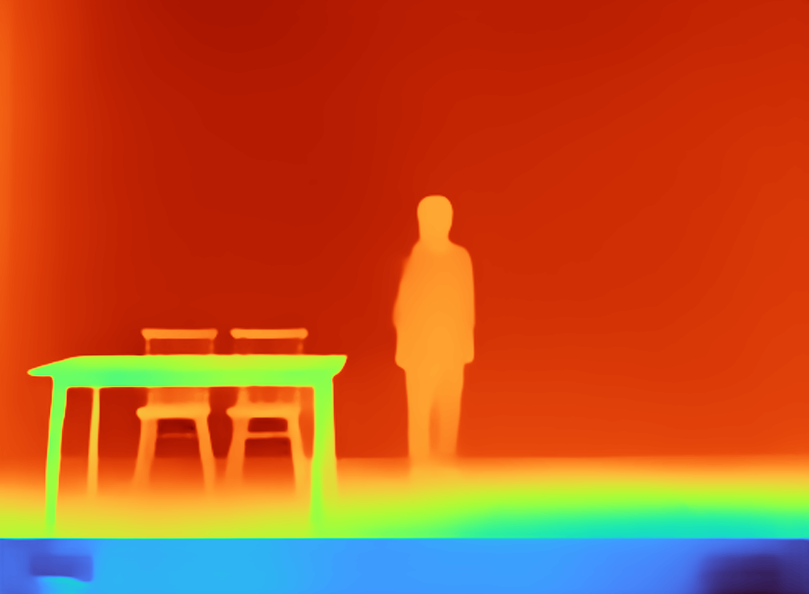

# 3D Reconstruction Dashboard (YOLO + MiDaS + Open3D)

This project provides a Gradio dashboard for object-aware 3D reconstruction and distance-based safety analysis from a single RGB image.

## Visual pipeline snapshots

### 1) Input scene



### 2) Object detection output (YOLO)



### 3) Depth estimation output (MiDaS)



### 4) 2D vs 3D distance concept


## What the pipeline does

- Detects person and indoor objects using YOLO.
- Estimates monocular depth using MiDaS.
- Back-projects object regions into 3D point clouds.
- Reconstructs object meshes with Open3D Poisson reconstruction.
- Computes person-to-object distances in meters.
- Compares 2D image-space vs 3D world-space distances in a tabular report.
- Generates proximity safety warnings based on thresholds.

## Stepwise pipeline

1. Input image
    - User uploads an image (file upload or webcam) in the dashboard.

2. Object detection (YOLO)
    - Runs YOLOv8n on configured COCO classes.
    - Produces bounding boxes, class labels, and confidence scores.

3. Depth estimation (MiDaS)
    - Estimates a dense depth map from RGB image.
    - Normalizes depth for downstream 3D reconstruction.

4. Camera model setup
    - Creates a camera intrinsic matrix from image size.
    - Uses this matrix for pixel-to-3D back-projection.

5. 3D point cloud extraction per detected object
    - Samples pixels inside each bounding box.
    - Converts sampled pixels and depth into 3D points.

6. Mesh reconstruction
    - Cleans point cloud with statistical outlier removal.
    - Estimates normals and runs Poisson surface reconstruction.
    - Applies mesh cleanup and smoothing.
    - Exports valid meshes to the gradio_meshes folder for viewer rendering.

7. Distance and safety analysis
    - Finds detected person point cloud.
    - Computes per-object:
      - 3D minimum distance (closest points)
      - 3D average center distance
    - Compares distance against safety thresholds and flags warnings.

8. 2D vs 3D comparison (table + explanation)
    - Computes 2D center distance in pixels and normalized image diagonal percent.
    - Displays side-by-side table with 2D metrics, 3D metrics, and depth gap.
    - Explains why 3D distance is more reliable for physical safety decisions.

9. Dashboard output tabs
    - Detection: Bounding-box overlay.
    - Depth Map: Colored depth visualization.
    - 2D vs 3D Distance: Tabular comparison + explanation text.
    - 3D Meshes: Select and inspect reconstructed object mesh.
    - Distance & Safety Analysis: Detailed warning/status report.
    - Summary: End-of-run statistics.

## Project files

- gradio_dashboard.py: Main dashboard and pipeline implementation.
- integrated_reconstruction_v2.py: Integrated reconstruction script variant.
- gradio_requirements.txt: Python dependencies for dashboard run.
- yolov8n.pt: YOLO model weights.
- start_dashboard.bat: Windows launcher.
- start_dashboard.sh: Linux/macOS launcher.

## Model and reasoning (beyond dashboard)

This section explains the technical thinking behind the pipeline, independent of UI tabs.

### Why this model stack

- YOLOv8n is used for fast, robust object localization and class labeling.
- MiDaS provides monocular depth priors from a single RGB frame without stereo sensors.
- Open3D is used for geometric post-processing and mesh reconstruction in a physically interpretable 3D space.

Together, these components convert 2D detections into approximate metric 3D geometry and enable safety-aware distance analysis.

### Core reasoning flow

1. Semantic grounding
    - Detect person + nearby objects so comparisons are class-aware and scene-aware.

2. Geometric lifting
    - Lift image pixels into 3D using depth + camera intrinsics.
    - This is the key step that turns pixel proximity into spatial proximity.

3. Object-wise reconstruction
    - Build point clouds and meshes per object to preserve object boundaries.
    - Remove outliers and smooth surfaces for stable distance computation.

4. Risk-oriented distance metrics
    - Compute minimum 3D distance (best for safety alerts).
    - Compute average center distance (best for coarse spatial relation).
    - Compare against per-class thresholds for warning logic.

5. 2D vs 3D interpretability
    - 2D distances are shown for reference.
    - 3D distances are used for actual safety decisions because they incorporate depth.

### Why 3D is more accurate than 2D here

- 2D pixel distance is projection-dependent and scale-ambiguous.
- Two objects can appear close in image coordinates but be far apart in depth.
- 3D distance measures Euclidean separation in reconstructed world coordinates, which better reflects real proximity.

### Assumptions and limitations

- Monocular depth is estimated, not directly measured; absolute scale can drift across scenes.
- Distances are approximate and should be treated as decision support, not certified metrology.
- Occlusion, motion blur, low light, and reflective surfaces can reduce reconstruction quality.

### Non-dashboard usage

If you want to run the core reconstruction pipeline outside the web UI, use:

- integrated_reconstruction_v2.py for script-style processing.

This is useful for automation, batch runs, and headless environments.

### Optional conceptual preview

An additional static comparison mockup is available:


## Setup

1. Use Python 3.10 to 3.12.
2. Install dependencies:

    ```bash
    pip install -r gradio_requirements.txt
    ```

3. Ensure yolov8n.pt exists in project root.

## Run

Windows:

```bash
start_dashboard.bat
```

or:

```bash
python gradio_dashboard.py
```

Linux/macOS:

```bash
bash start_dashboard.sh
```

When launched, open:

```text
http://127.0.0.1:7860
```

## Safety threshold defaults

- General objects: 1.0 m
- Person class threshold: 0.5 m

Thresholds are configurable in gradio_dashboard.py.

## Notes

- Monocular depth is relative and scene-dependent; metric values are approximate but still better grounded than pure 2D pixel distance.
- Reconstruction quality improves with clear images, visible object boundaries, and moderate clutter.
